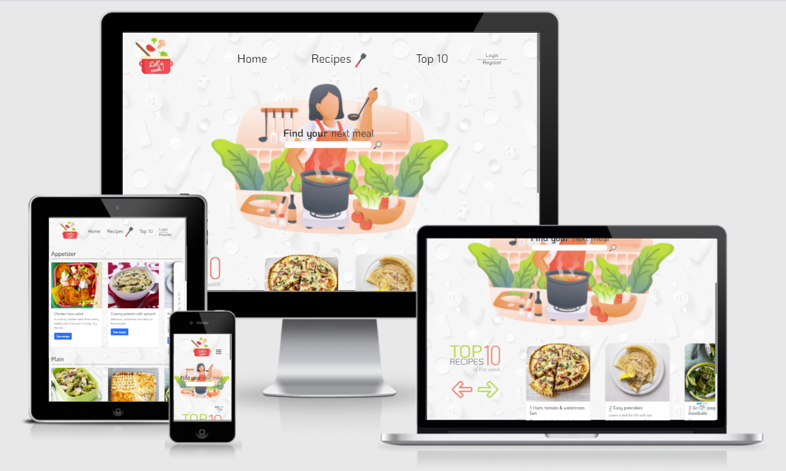
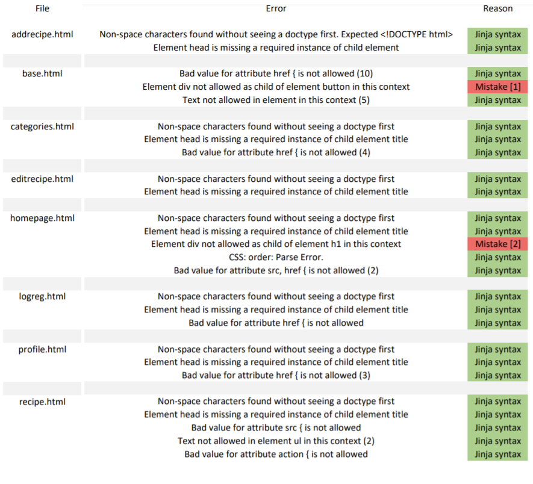

# Let's cook

Let’s cook is a website featuring recipes added by the community. It could be a source of inspiration for your next meal or a place to share your creation. The main goal of the project is to enable the user to interact with a database, preforming basic data manipulation operations.

This is the third project in Code Institute Full Stack Developer program based on HTML, CSS, JavaScript, Python, Flask, MongoDB and other optional frameworks and libraries.

## UX

### User Stories

- I want to be able to create an account
- I would like to save my favourite recipes
- I am looking for something to cook for my next meal
- I wish to know how good a recipe is before preparing it
- I created a recipe of which I am proud of and would like to share it
- I want to know basic information about the recipe such as steps, ingredients and cooking time

### Potential Features

##### Navigation
- The navigation will include a home link, category dropdown, top 10 recipes section on the homepage and a random recipe link. There will also be variable links like login/profile, add a recipe and others that will appear if the user is logged in.

##### Profile
- The website will be entirely based on user submited recipes requiring an option to login/register. Each person's profile will include brief information which the user has the option to provide. The users can select a profile icon from a small icon library and possible feature of uploading an image. The profile should also include recipes that the user has saved and posted and potentialy their score based on the average rating of their posted recipes. The users should be able to update personal data or uploaded recipes as well as delete their account. 

##### Homepage
- The main page will include a hero image with a recipe search bar and an animation which shows different meals. 

##### Top 10 Recipes
- Top recipe section will include a carousel that repeats infinitely putting the first recipe at the end when going foward and vice versa. The featured recipes will include the top rated/most popular recipes of each week.

##### Categories
- Categories page will show recipes for each category or just the selected category depending on which path the user chooses. There should also be a filtering system allowing to filter recipes by rating and prep time.

##### Chosen recipe page
- The recipe page will include all relevant information like the ingredients, preparation time and cooking steps. As additional features to better judge the quality of the recipe, there will be a comment section and rating system on the page.

##### Footer
- The footer will be simple with a small about section revealing a brief description on hover.  It will also include social links and the website logo.

### Wireframes

[Sketched wireframe](static/img/readme_images/sketch.png)
> For this project I drew simple wireframes so it is not as detailed as it would have been in Adobe XD wich I usually use. They still give the general idea of how the webpage should look and which sections it should have.

### Colors

[Color palette](static/img/readme_images/palette.png)
>The color palette is a general idea for the colors selected from the hero image. The shades and combinations can change as the image I created is just a guide of which colors could work well together.

## Technologies used

##### Languages, frameworks and more
 HTML5 - webpage markup language for basic structure

 CSS3 - HTML document styling language 

 Bootstrap - CSS framework with focus on responsive design

 JavaScript - behavior of elements on the website 

 jQuery - JavaScript library

 Python - backend programming language working together with Flask, MongoDB and Heroku

 Flask - lightweight Python framework for web applications

 MongoDB - database program

 Heroku - cloud deployment platform

##### Repository, coding environment and version control
- [Github](https://www.gitpod.io/) - hosting platform for managing repositories and more
- [Gitpod](https://www.gitpod.io/) - coding environment
- [Git](https://git-scm.com/) - used for version control

#####  Resources
- [Google Fonts](https://fonts.google.com/) - source for all fonts on the website
- [Envato Elements](https://elements.envato.com/) - hero image source
- [Flaticon](https://www.flaticon.com/) - used for icons
- [BBC Good Food](https://www.bbcgoodfood.com/) - recipe content

## Deployment

The website can be accessed [here](https://ms3-lets-cook.herokuapp.com/).

Deployment instructions assume that you have already set up your repository and basic flask application. The website is deployed on the Heroku cloud platform using the following steps:
1. Create the necessary files for deployment
    - Create requirements file using `pip3 freeze > requirements.txt` which will contain the required dependencies.
    - Create Procfile using `echo web: python app.py > Procfile`.
    - Push both files to GitHub
2.	Log in to Heroku and create a new app
3.	Connect the app to your project
    - Go to deployment method section and choose the method. If using GitHub, select that option, otherwise use the Heroku CLI method.
4.	Following the GitHub method, search for the desired repository and connect to it
5.	Enter configuration variables
    - Go to the settings tab and select Reveal Config Vars. Enter the variables defined in the env.py file (IP, PORT and SECRET_KEY).
6.	Deploy and preview
    - Go back to the deployment tab and enable automatic deployment.
    - Finally, press deploy branch and preview your website.

## Commit messages
The commit messages follow conventional commit format: **type(optional scope): description**. Here are the commit message types used in this project:  

1. Fix: bug fixes
2. Feat: new features
3. Docs: adding content to README
4. Style: adding comments, spaces and other style changes
5. Refractor: editing code but not functionality e.g. renaming a variable

> The first 25 commit messages do not follow the standard. I started using the new format after receiving the feedback for the previous project.

## Testing

### User stories testing

- I want to be able to create an account.

> *Register/ log in options are available.*

- I would like to save my favourite recipes.

> *There is the option to save/ unsave a recipe.*

- I am looking for something to cook for my next meal.

> *Unlimited number of recipes can be added by the users and the top ones are shown on the homepage. The user can also search for recipes.*

- I wish to know how good a recipe is before preparing it.

> *There is a rating for each recipe and an option to add a rating.*

- I want to know basic information about the recipe such as steps, ingredients and cooking time.

> *All of the above information is on the recipe page as well as adittional information*

### Code validation

##### HTML

HTML validation has a lot of errors. Most of them come from Jinja syntax which should not be a problem. I have probably taken too many features to implement and should have given myself more time to fix the issues that come up during testing. As I have finished the last feature a day before submission, I had to leave some of the validation errors as they are and will explain them here.
The mistakes that were not fixed:

1. Div element is a child of the button element. I have had issues with the Bootstrap navbar close. I have decided to create my own closing icon and have therefore put it inside the button element.

2. Element div not allowed as child of element h1 in this context. I had trouble getting the food window to work and it was a way that enabled me to resolve the issue.
##### CSS
> W3C validation passed with no errors

### Browser Compatibility

Testing for desktop is done on Mozilla Firefox, Google Chrome, Microsoft Edge and Opera. It is not tested on Internet Explorer since the support for it is ending soon and most websites already do not support it. 

Mobile testing is done on Samsung Internet and Google Chrome for mobile on different devices.

> There are no issues or changes across browsers apart from how the scrollbar looks on Firefox which is not an issue. I do not have access to older browsers or other devices. There is a tool which has that functionality but it is not free and probably not needed for the purposes of this project.

#### Javascript
> [Beautify Tools](https://beautifytools.com/javascript-validator.php) validation passed with no errors

##### Python
> Code is PEP8 compliant and validation shows no errors

## Credits
- All recipe images and content was taken from [BBC Good Food](https://www.bbcgoodfood.com/).

- All icons and images from Flaticon and Envato elements have been licenced.

- All code was written by me apart from the vendor prefixes that were added using [Autoprefixer](https://autoprefixer.github.io/).  As always, I have used [StackOverflow](https://stackoverflow.com/), [MDN Web Docs](https://developer.mozilla.org/en-US/) and [W3Schools](https://www.w3schools.com/) as a source of inspiration.
